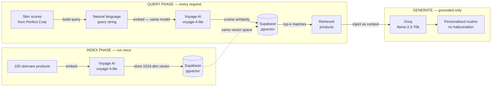
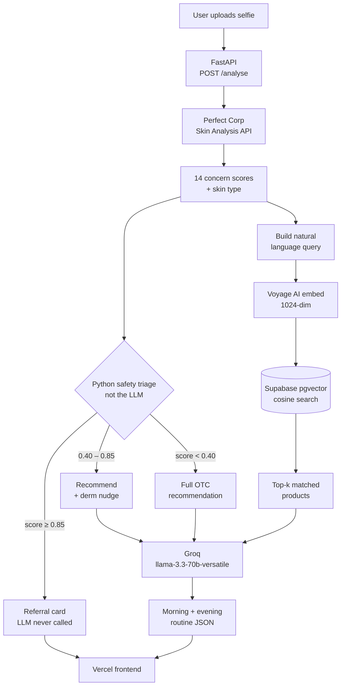

# Confidence

A RAG-powered skincare intelligence system - selfie to personalised routine in under 60 seconds.


**Live:** https://confidence-two.vercel.app | **API:** https://confidence-api-59597652459.us-central1.run.app/health

---

## What is RAG and why it matters here

Without RAG, a language model generates skincare recommendations from its training data — generic, unverifiable, hallucinated product names and ingredients.

Confidence uses **Retrieval-Augmented Generation**. The LLM never invents products. Every recommendation traces back to a real row in a vetted product database.

---

## How RAG works in Confidence



> The same embedding model is used at both index time and query time. Using different models would place vectors in different semantic spaces — similarity scores would be meaningless.

---

## Full system architecture



---

## RAG knowledge base

| Detail | Value |
|---|---|
| Products indexed | 100 |
| Embedding model | Voyage AI `voyage-4-lite` |
| Vector dimensions | 1024 |
| Database | Supabase pgvector |
| Similarity metric | Cosine |
| Top-k retrieved | 3 per query |
| Query source | Skin concern scores → natural language |

---

## Safety design

The triage runs in Python **before** the LLM is called. Severe concerns are never sent to the LLM.

| Tier | Score | Action |
|---|---|---|
| Mild | 0 – 0.40 | Full OTC recommendation |
| Moderate | 0.40 – 0.85 | Recommendation + 8-week derm nudge |
| Severe | 0.85+ | Referral card only — LLM skipped |

LLM system prompt hard limits: no diagnoses, no prescriptions, only reference retrieved products.

---

## Stack

| Layer | Choice |
|---|---|
| Backend | FastAPI (Python) — Google Cloud Run |
| Skin analysis | Perfect Corp HD skin-analysis API |
| Embeddings | Voyage AI `voyage-4-lite` (1024-dim) |
| Vector store | Supabase pgvector |
| LLM | Groq `llama-3.3-70b-versatile` |
| Frontend | HTML — Vercel |

---

## Local setup

```bash
git clone https://github.com/rkchellah/Confidence.git
cd Confidence
pip install -r requirements.txt
cp env.example .env.local
# Fill in all values

# Seed the RAG knowledge base — run once
python scripts/build_product_db.py

# Start the backend
uvicorn backend.main:app --reload

# Open frontend/index.html in your browser
```

---

## Project structure

```
confidence/
  backend/
    perfect_corp.py      — Perfect Corp API client (async upload → task → poll)
    rag_products.py      — Voyage AI embed + Supabase pgvector retrieve
    routine_generator.py — Groq + 3-tier triage + structured JSON
    main.py              — FastAPI routes + CORS
  frontend/
    index.html           — Landing page + upload/results
  scripts/
    build_product_db.py  — RAG knowledge base seeding (run once)
    sample_products.json — 100 product knowledge base
  Dockerfile
  requirements.txt
```
